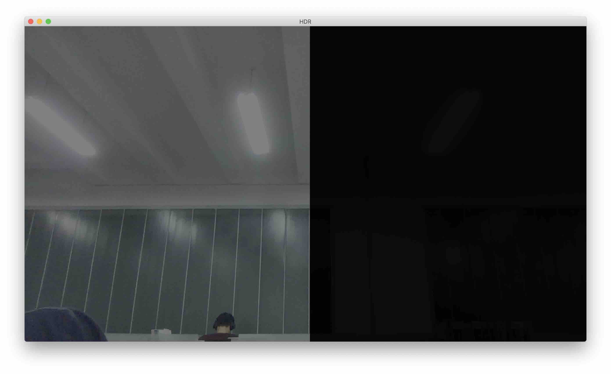

## IPFinal of Zhou Hao (42yeah)!



This is the Image Processing Final of mine, to present the power of HDR.

### Prerequisites

- `cmake`
- `OpenCV`
- `GLFW`
- `GLM`

### How to build?

```sh
mkdir build
cd build
cmake ..
make
```

### How to run?

First you need to build it. Then:

```sh
cd build # if you are not there yet
./HDR
```

